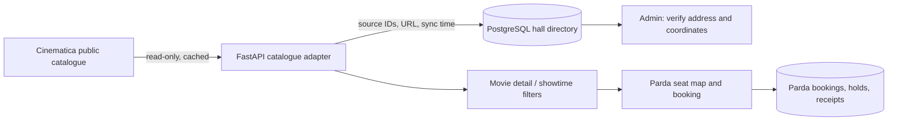

# Parda Cinema

Parda is an Uzbek-first cinema discovery and seat-booking app. The React/Vite frontend uses a FastAPI backend and PostgreSQL. Prices are in UZS and showtimes use `Asia/Tashkent`.

- **Public demo:** https://sana-booking.vercel.app/
- **API docs:** https://parda-cinema-api.onrender.com/docs
- **Source:** https://github.com/oktambek7/booking-system

> Parda reads Cinematica's public film and repertory feeds only for discovery and schedule previews. Parda never forwards customers to an external checkout. Its own managed sessions use Parda's PostgreSQL seats, holds, bookings, and demo payment flow.

## Delivery state

- [x] PostgreSQL models for accounts, movies, halls, seats, showtimes, seat holds, bookings, and verification attempts
- [x] Four-digit email verification flow with expiring, limited-attempt hashed codes
- [x] TMDB region-aware current/upcoming catalog; configurable multi-page import of original titles, cast, posters, trailers, and release dates
- [x] Cinematica live now-playing/upcoming movie catalog with age marks, posters, audio language, format, and read-only repertory previews
- [x] Film-first discovery: compact paginated posters, animated current-film carousel, and movie-specific dates/hall filters
- [x] Background TMDB refresh every 24 hours when a server token is configured
- [x] Explicit Standard/VIP auditorium types and schedule filtering
- [x] Seat selection, ten-minute pending holds, booking history, status transitions, and a visible 30-minute customer cancellation policy
- [x] Customer history clearing for cancelled/completed bookings (soft-archived; audit rows and active bookings are retained)
- [x] In-app card-form checkout: Uzcard, Humo, Visa, and Mastercard choices, booking summary, email code verification, current expiry validation, resend limits, and no real charge
- [x] Rolling Parda-owned demo sessions when the managed calendar has no future schedule
- [x] PostgreSQL protection against concurrent double booking and overlapping hall schedules
- [x] Uzbek/English/Russian UI, light/dark themes, accessible date chips, and responsive cinema artwork
- [x] Brevo transactional email delivery for signup verification, payment codes, and password resets
- [x] Live Cinematica programme discovery with five-minute refreshes and a bounded stale-cache fallback
- [x] Self-contained card checkout flow for Uzcard, Humo, Visa, and Mastercard with email-code confirmation
- [x] Customer cancellation, booking-history archival, expiring seat holds, and PostgreSQL protection against competing seat requests
- [x] Cinematica hall-directory sync keyed by public cinema and hall IDs, with traceable source URL and sync time
- [ ] Ticketon live cinema feed requires provider-approved cloud access; Ticketon currently returns HTTP 403 to the deployed Render service
- [x] Movie-detail cinema, format, language, Standard/VIP, and price filters
- [x] User-triggered nearest-cinema sorting using verified hall coordinates only
- [x] Protected catalog sync, sync-status, nearby-hall, and hall-coordinate API endpoints
- [x] Role-gated cinema operator dashboard for daily session capacity, ticket activity, confirmed revenue, hall inventory, schedule creation, and TMDB catalog refresh
- [x] QR e-tickets with opaque server-issued codes and a one-time operator check-in flow

## Assignment requirement mapping

The original assignment describes appointments. Parda applies the same booking model to a cinema: a **movie** is the service, an **auditorium/cinema operator** is the provider, and a **screening** is the dated availability window.

| Requirement | Parda implementation |
| --- | --- |
| Service name, description, duration, price | Admin can create films with title, synopsis, duration, genre, age mark, language, and poster. The screening form sets the server-owned ticket price. |
| Provider / employee | Admin creates cinema auditoriums with seat plans, timezone, formats, and Standard/VIP category. A cinema operator manages the associated schedules. |
| Availability | Admin schedules a film in an auditorium. The API rejects past times and overlapping hall intervals. |
| Users see available times and book | The film page fetches date, hall, format, price, and available-seat data before seat selection. |
| Pending, confirmed, cancelled, completed | `BookingStatus` supports all four states. A hold starts as pending; a verified demo payment confirms it; customers can cancel eligible tickets; admins complete finished screenings. |
| No double booking | PostgreSQL row locks plus the partial unique active-seat index return a conflict to competing seat requests. |
| Backend API, auth, validation, history | FastAPI endpoints are documented at `/docs`; JWT auth, Pydantic validation, email verification, booking history, soft history clearing, and role-gated administration are included. |
| Timezone, email, dashboard, Docker, docs | `Asia/Tashkent` is stored with halls, Brevo sends OTP email, the cinema operator dashboard manages films, halls, schedules, capacity and ticket states, Docker Compose and API docs are supplied. |

### Edge cases addressed

- A seat hold expires after ten minutes; expiry releases its seat assignments while preserving the audit record.
- Two customers selecting the same seat are serialized by the database. One booking succeeds, and the other receives HTTP 409 with current availability on refresh.
- A user cannot book a past screening, choose a seat outside that auditorium, submit duplicate or more than eight seats, or cancel once the 30-minute pre-screening cutoff is reached. Admins can release an unused future booking while preserving its audit record.
- A second payment verification attempt cannot confirm someone else’s booking. Codes are hashed, expire, limit attempts, and are rate limited for resend.
- A paid ticket receives a non-personal, unique `PRD-` code. Check-in accepts it only once, only while the screening entry window is open, and never admits cancelled, pending, or already-used tickets.
- External discovery data is never the seat source of truth. Cinematica’s read-only programme is cached fresh for five minutes and can serve a bounded stale result for up to 24 hours when its upstream service is temporarily unreachable.
- New and returning unverified accounts resume the same verification flow without creating duplicate users; password resets are restricted to verified accounts.

## Demo checkout

The checkout is intentionally a **demo payment**. It accepts a syntactically valid card number, holder name, current or future expiry date, and CVV for Visa or Mastercard, then emails a four-digit confirmation code and marks the Parda booking as confirmed. No processor is contacted and no money moves.

On startup, Parda fills the next seven days of missing managed demo slots from its existing active films and halls. Existing screenings and conflicting slots are preserved.

The app accepts card details only to validate this one demo attempt. It stores only the last four card digits on the payment receipt. It never stores, logs, returns, or emails a card number, holder name, expiry, or CVV. Payment email codes are HMAC digests, expire after five minutes, allow five attempts, and have resend limits.

TMDB provides movie metadata, not theater schedules or seat inventory. Cinematica's public data is cached for discovery only. It does not give Parda authority to lock source seats, sell source tickets, or guarantee the source feed. A real release needs operator-owned halls/schedules and a licensed payment provider with hosted or tokenized card entry.

## Run locally

Requires Python 3.12+, Node.js, and Docker Desktop.

```sh
docker compose up --build
```

The API runs at `http://localhost:8000`; docs: `http://localhost:8000/docs`. Copy `backend/.env.example` to `backend/.env`, set strong random `JWT_SECRET` and `OTP_SECRET` values, and set `EMAIL_MODE=mock` with `APP_ENVIRONMENT=development` for local signup verification. The mock OTP is returned only in this local mode.

Create `frontend/.env.local` with `VITE_API_URL=http://localhost:8000`. Then:

```sh
cd frontend
npm install
npm run dev
npm run build
```

A local admin can be created with:

```sh
docker compose exec -e ADMIN_EMAIL=admin@example.com -e ADMIN_PASSWORD='use-a-long-unique-password' api python -m app.bootstrap_admin
```

## Deployment

### Render API

Deploy from `render.yaml`, attach PostgreSQL, and set these private values in the service environment:

- `DATABASE_URL`, `TMDB_READ_TOKEN`, `JWT_SECRET`, `OTP_SECRET`
- `CORS_ORIGINS` to the exact production frontend origin
- `EMAIL_MODE=brevo`, `BREVO_API_KEY`, `BREVO_FROM` (recommended for production)
- `APP_ENVIRONMENT=production`

`TMDB_MAX_PAGES` sets the number of pages imported per category (default 5); `TMDB_SYNC_INTERVAL_HOURS` sets the refresh interval (default 24). TMDB tokens must remain server-side. Public signup needs a transactional email sender. The application supports Brevo's HTTPS API, Resend, and SMTP. For Brevo, register and verify the sender email address, create an API key, and keep both values only in the deployment environment. A custom sending domain improves delivery reputation but is not required for initial sender-email verification.

Bootstrap the admin with `ADMIN_EMAIL` and a unique `ADMIN_PASSWORD` of at least 12 characters. Configure real, operator-provided cinema halls, seat plans, prices, and screening schedules through the admin tools.

To grant the existing project owner a one-time operator role, set
`OPERATOR_BOOTSTRAP_NICKNAME` to that user's exact nickname, deploy once, and
then remove the variable. This bootstrap only promotes an existing account;
public users cannot self-assign roles.

### Vercel frontend

Set `VITE_API_URL` to the API origin and redeploy. Set the API `CORS_ORIGINS` to the exact Vercel site origin.

## Booking and data safeguards

- Passwords and email-code digests are HMAC-protected, expire, and have attempt limits.
- API validates seat ownership and availability and calculates prices from current screening/seat data. A pending booking holds seats for ten minutes.
- Row locks and a partial unique index on active `(screening_id, seat_id)` assignments prevent competing bookings from taking the same seat. Collisions return HTTP 409.
- A PostgreSQL exclusion constraint prevents overlapping screenings in one hall. Cancelled and expired holds release seats while retaining booking history.
- Duplicate, foreign, past-screening, and excessive seat selections are rejected. Customers can only cancel their own eligible bookings.
- Demo payment attempts are bound to the authenticated booking and server-calculated total. A production payment provider must verify signed callbacks and transaction amount/order before a booking can be confirmed.
- Customer history clearing archives only cancelled and completed rows. Upcoming active holds/tickets remain visible; users cancel eligible bookings first.

## Cinema catalogue architecture



### Data policy and synchronization

- Cinematica is used only as a public discovery source. Parda does not access source checkout, source customer data, or source seat inventory.
- The sync reads current public movie repertory, rejects disabled, malformed, started, and expired rows, then upserts halls by `source_name + external_hall_id`. It stores the source cinema ID, hall ID, source URL, and `last_synced_at`.
- A scheduled Parda session is hidden when its managed inventory is sold out. A source time that clashes with a managed session in the same imported hall is also hidden before a customer can enter the seat map.
- Source payloads have a five-minute fresh cache and a 24-hour bounded stale fallback for read-only discovery. A source failure does not block Parda bookings that already exist.
- Cinematica-imported locations are deliberately blank until a cinema operator supplies verified address and latitude/longitude through the protected hall update endpoint. The UI never estimates a distance.

### Tashkent cinema sources

The movie detail page derives cinema filter choices from only the source sessions
returned for that film and date. This avoids a visitor selecting an operator
that has no matching time. `Tashkent City` comes from the existing Cinematica
public feed.

The code includes a narrow Ticketon adapter for CinemaPlex, Next Cinema,
Compass Cinema, Riviera Cinema, Parus Cinema, Magic Cinema, Sergeli Cinema,
Premier Cinema — Park in Mall, and O‘zbekiston Milliy kino san’ati saroyi. It
uses Ticketon’s public session API and accepts only future `on_sale` responses.
Ticketon currently returns HTTP 403 to the Render cloud service, so it does not
show an incomplete or invented programme in production. Provider-approved API
credentials or an allow-listed service IP are required before enabling that
live source. When available, the source is revalidated when a visitor selects
a time; a removed or off-sale time returns an unavailable response.

### Nearby cinemas and privacy

The site asks for browser location only after the visitor presses **Find cinemas near me**. It calculates a Haversine distance only for halls with verified map coordinates, and keeps the browser location in client memory. A live source venue can remain selectable without coordinates; it is simply not assigned a made-up distance. The API also supports server-side distance sorting through `GET /api/cinemas/nearby?lat=&lng=` for clients that need it.

### Directory and sync API

| Endpoint | Access | Purpose |
| --- | --- | --- |
| `GET /api/cinematica/movies/{id}/screenings` | Public | Current valid source showtimes for one movie |
| `POST /api/cinematica/movies/{id}/ticketon/{session_id}/ticketing` | Public | Re-validates an on-sale Ticketon time then creates Parda's owned seat map |
| `GET /api/cinemas?city=Tashkent` | Public | Active Parda and imported halls |
| `GET /api/cinemas/nearby?lat=&lng=` | Public | Halls with verified coordinates, ordered by distance |
| `PATCH /api/cinemas/{id}` | Admin | Verify address, coordinates, formats, hall type, or disable a hall |
| `GET /api/admin/dashboard?date=YYYY-MM-DD` | Admin | Date-scoped session occupancy, booking activity, and confirmed-revenue dashboard |
| `GET /api/admin/cinemas` | Admin | Complete hall inventory, including disabled halls, for the operator workspace |
| `POST /api/admin/tickets/check-in` | Admin | Validate a confirmed e-ticket code once during the screening entry window |
| `POST /api/admin/catalog-sync` | Admin | Run the idempotent source hall-directory sync |
| `GET /api/admin/catalog-sync/status` | Admin | Inspect imported hall count and most recent sync time |

## Verification

```sh
python -m unittest discover -s backend/tests -v
cd frontend && npm run build
```

The unit checks cover source-showtime normalization, source IDs, disabled/malformed rejection, and Asia/Tashkent-to-UTC conversion. PostgreSQL is responsible for active-seat uniqueness and hall-time exclusion; run concurrent booking checks against the configured PostgreSQL staging database before a commercial release.

## Known source limits

The public Cinematica feed currently provides cinema/hall labels, session time, price, and source identifiers. It does not provide verified street addresses, coordinates, physical capacities, cancellation state, or source seat counts. Parda therefore does not invent those fields. Complete operator verification and a licensed payment provider remain required before taking real money.

## TMDB attribution

Movie metadata and artwork are provided by TMDB. This product uses the TMDB API but is not endorsed or certified by TMDB. See [TMDB API documentation](https://developer.themoviedb.org/docs).

## Architecture and AI use

The React client presents a read-only public catalog alongside Parda-managed sessions. FastAPI proxies and caches discovery routes for five minutes. Parda's PostgreSQL models are the source of truth for Parda accounts, seats, holds, bookings, payments, and payment email challenges. TMDB remains a metadata/import source for the admin-managed catalog.

AI tools helped draft and revise UI, API/data-model scaffolding, and edge-case documentation. Review the implementation and provider behavior before production; verify real callbacks and concurrent seat reservations against staging data.
